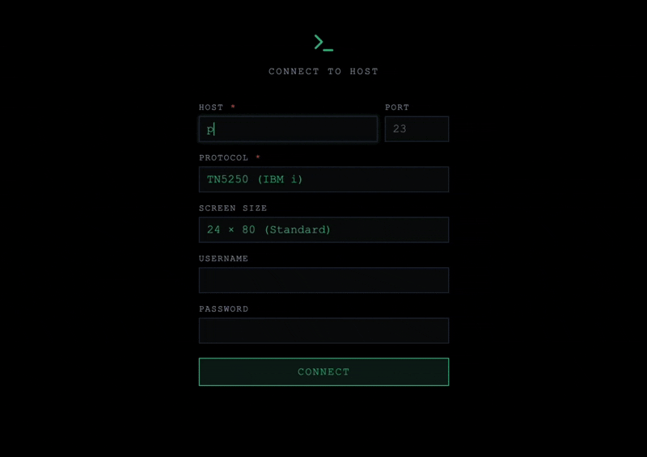

# Green Screen React

Legacy terminal emulator for React. Supports **TN5250** (IBM i / AS/400). TN3270, VT220, and HP 6530 are accepted as protocol parameters but have not been properly tested yet.

[](https://visionbridge-solutions.github.io/green-screen-react/)

## Getting Started

```bash
git clone https://github.com/visionbridge-solutions/green-screen-react.git
cd green-screen-react
npm install
npm run dev
```

Opens the demo app at `http://localhost:5173/green-screen-react/` with the proxy on port 3001 by default.

## Standalone Use

Run a web-based terminal without cloning the repo:

```bash
npx green-screen-terminal
```

Opens a browser-based terminal on `http://localhost:3001`. Use the sign-in form to connect to any supported host.

## Use in Your Project

```bash
npm install green-screen-react green-screen-proxy
```

See [green-screen-react](https://www.npmjs.com/package/green-screen-react) and [green-screen-proxy](https://www.npmjs.com/package/green-screen-proxy) on npm for integration docs.

## How It Works

Browsers can't open raw TCP sockets. The proxy bridges WebSocket to TCP:

```
  React App               Proxy                    Host
┌────────────┐        ┌────────────┐        ┌────────────┐
│ <GreenScreen│  WS    │  Node.js   │  TCP   │  IBM i     │
│  Terminal/> │◄──────►│  :3001     │◄──────►│  Mainframe │
└────────────┘        └────────────┘        └────────────┘
```

## Project Structure

```
packages/
  react/       → green-screen-react      (npm)   React component
  proxy/       → green-screen-proxy      (npm)   WebSocket-to-TCP proxy
  standalone/  → green-screen-terminal   (npm)   Standalone CLI
  types/       → green-screen-types               Shared type definitions
  client-py/   → green-screen-client     (PyPI)  Python async client
                                                 (ships independently)
apps/
  demo/      Example Vite app
  worker/    Cloudflare Worker deployment
```

## Features

- **TN5250** — tested and supported (IBM i / AS/400)
- **TN3270, VT220, HP 6530** — accepted as parameters but not thoroughly tested
- **Real-time WebSocket** — instant screen updates
- Protocol-specific colors and screen dimensions
- Keyboard input: text, function keys (F1–F24), tab, arrows
- Field-aware rendering with input underlines
- Typing animation with correction detection
- Auto-reconnect with exponential backoff
- Themeable via CSS custom properties
- Inline sign-in form (host, credentials, protocol picker)
- Pluggable adapter interface
- Zero runtime dependencies (peer dep: React 18+)

## What's New in v1.3.x

**Terminal pluggability (React)**
- `theme` prop — built-in `'modern'` and `'classic'` presets (phosphor palette, zero-radius corners in Classic).
- `header` prop — fully pluggable header (render prop, ReactNode, or `false` to hide).
- `autoConnect`, `persistFocus`, `alwaysFocused` props for tighter embedding control.
- Collapsible "Show all params" block in the inline sign-in form; non-secret fields persisted to `localStorage`.
- Optimistic cursor prediction for arrow keys / TAB; key-lock badge reflects submit-key presses immediately.
- WDSF / `CREATE_WINDOW` popups render as styled overlays (plus a heuristic detector for plain-char popups).

**Proxy robustness**
- Keep-alive upgraded from TELNET `NOP` → **Timing Mark** (hosts actually acknowledge it).
- Graceful `SIGNOFF` on shutdown + new `/disconnect-all` endpoint.
- Sign-on screen detected structurally (via text matching), not by field attributes — no more false negatives on custom sign-on messages.
- TN5250 parser: native-underscore attribute exception fixes missing fields on `STRSQL` and similar screens.
- Local-key REST path now broadcasts screen updates over WS.

**Demo app**
- Modern / Classic theme toggle with side-switching transition.
- Refreshed header: `@green-screen-react` badge, npx pill, and GitHub button pinned to the terminal edge.

See [CHANGELOG](https://github.com/visionbridge-solutions/green-screen-react/releases) for the full list.

## License

MIT
